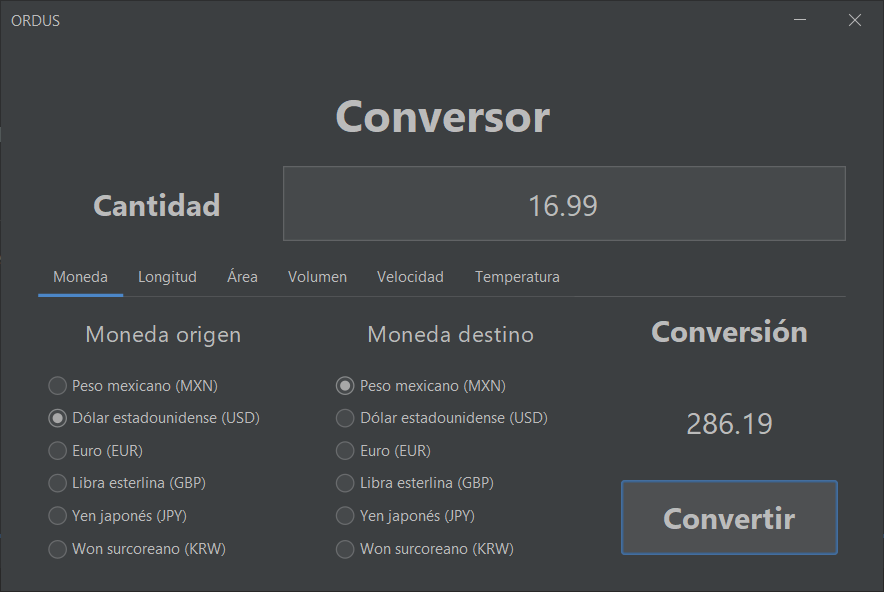
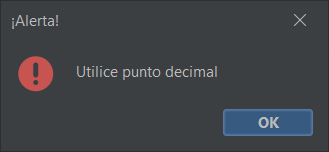
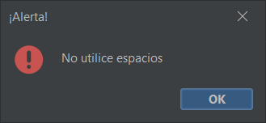
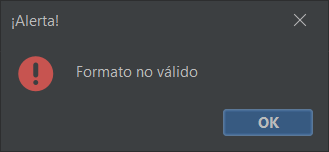

# Conversor - Challenge ONE Java Backend

<h4 align="center">:construction: Proyecto en construcción :construction:</h4>

Este proyecto responde al challenge: [Challenge Back End Java - Conversor](https://www.aluracursos.com/challenges/oracle-one-back-end/conversordemoneda/sprint01) del programa [ONE](https://www.oracle.com/mx/education/oracle-next-education/) para el grupo G5.

Consiste en una serie de herramientas de conversión para las cantidades:

1. [Moneda.](#moneda)
2. Longitud.
3. Área.
4. Volumen.
5. Velocidad.
6. Temperatura.

## Moneda

La función principal de este conversor consiste en convertir entre las divisas:

* Peso mexicano (MXN).
* Dólar Estadounidense (USD).
* Euro (EUR).
* Libra esterlinas (GBP).
* Yen japonés (JPY).
* Won surcoreano (KRW).



El formato numérico aceptado por el conversor utiliza punto como separador de decimales y no utiliza separador de miles. Utilizar la coma como separador decimal o de miles causará el lanzamiento de un cuadro de alterta:



Si se utiliza el espacio como separador de miles saltará el correspondiente cuadro de alerta:



Si se utiliza literales junto con los valores numéricos saltará el cuadro de alerta por formato no válido (esto no aplica para notación exponencial):



Al hacer uso de la clase `BigDecimal` de Java el conversor acepta el uso de notación exponencial:


### Open Exchange Rates APP_ID

El programa consume la API [Open Exchange Rates](https://openexchangerates.org/) la cual posee una versión sin costo, pero requiere una APP_ID. Para utilizar su propia APP_ID guadela en el archivo `info.key` en el directorio `.env` dentro del directorio raíz del proyecto, bajo el formato:

```
---- BEGIN KEY ----
'Aquí va su APP_ID' 
---- END KEY ----
```
### Uso de la clase `Moneda`

Dentro de la paquetería `com.model` se encuentra la clase `Moneda` la cual se puede utilizar para instanciar una moneda al proveer con el correspondiente código de la moneda:

`Moneda miMoneda = new Moneda(codigoMiMoneda)`

El código de moneda debe ser provisto de acuerdo a la norma [ISO](https://www.six-group.com/en/products-services/financial-information/data-standards.html#scrollTo=maintenance-agency).

La clase `Moneda` contiene el método `conversion()` el cual requiere que se especifique el monto a convertir y la moneda a la cual corresponde dicho monto:

`miMonedaDestino.conversion(monto, miMonedaOrigen)`

Tanto el monto a convertir como el monto resultante de la conversión son objetos de tipo `String` debido al uso de la clase `BigDecimal`.

Para hacer uso de la clase `Moneda` es necesario poder acceder a la [API](#open-exchange-rates-app_id) de [Open Exchange Rates](https://openexchangerates.org/).