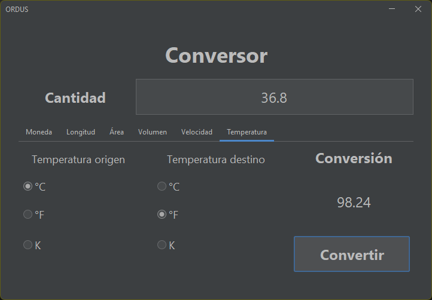

# Conversor - Challenge ONE Java Backend

Este proyecto responde al challenge: [Challenge Back End Java - Conversor](https://www.aluracursos.com/challenges/oracle-one-back-end/conversordemoneda/sprint01) del programa [Oracle Next Education](https://www.oracle.com/mx/education/oracle-next-education/) ofrecido por [Alura Latam](https://www.aluracursos.com/) en conjunto con [Oracle](https://www.oracle.com/mx/).

Consiste en una serie de herramientas de conversión para las cantidades:

1. [Moneda](#moneda)
2. [Longitud](#longitud)
3. [Área](#área)
4. [Volumen](#volumen)
5. [Velocidad](#velocidad)
6. [Temperatura](#temperatura)

## Moneda

La función principal de este conversor consiste en convertir entre las divisas:

* Peso mexicano (MXN)
* Dólar Estadounidense (USD)
* Euro (EUR)
* Libra esterlinas (GBP)
* Yen japonés (JPY)
* Won surcoreano (KRW)


El formato numérico aceptado por el conversor utiliza el punto como separador de decimales y no utiliza separador de miles. Utilizar coma como separador decimal o de miles, espacio como separador de miles o caracteres no decimales (a excepción de 'e' para notación exponencial) resultará en un error de formato:


Al hacer uso de la clase `BigDecimal` de Java el conversor acepta el uso de notación exponencial:


### Open Exchange Rates APP_ID

El programa consume la API [Open Exchange Rates](https://openexchangerates.org/) la cual posee una versión sin costo, pero requiere una APP_ID. Para utilizar su propia APP_ID guadela en el archivo `info.key` en el directorio `.env` dentro del directorio raíz del proyecto, bajo el formato:

```
---- BEGIN KEY ----
'Aquí va su APP_ID' 
---- END KEY ----
```

Cuando no se dispone de una `KEY_ID` el conversor lanzará el siguiente cuadro de error:


y se procederá a proveer de una conversión utilizando los valores por defecto.

### Error de conexión

Cuando no sea posible establecer una conexión con [Open Exchange Rates](https://openexchangerates.org/) el conversor lanzará un cuadro de diálogo referente al error de conexión y procederá a utilizar los valores por defecto:


## Longitud

La app provee de un conversor de longitudes, los factores de conversión están 'hard-coded' en la app con al menos cinco cifras significativas para factores no racionales.


El conversor de longitud nos permite convertir entre las siguientes unidades de longitud:

* Metro ($m$)
* Centímetro ($cm$)
* Milímetro ($mm$)
* Kilómetro ($km$)
* Pie ($ft$)
* Pulgada ($in$)
* Yarda ($yd$)
* Milla ($mi$)

Se provee del factor de conversión utilizado, redondeado a cuatro posiciones decimales.

## Área

El conversor de área nos permite convertir entre las siguienes unidades:

* Metro cuadrado ($m^2$)
* Centímetro cuadrado ($cm^2$)
* Milímetro cuadrado ($mm^2$)
* Pie cuadrado ($ft^2$)
* Pulgada cuadrada ($in^2$)
* Yarda cuadrada ($yd^2$)
* Hectárea ($Ha$)


Se provee del factor de conversión utilizado, redondeado a seis posiciones decimales.

## Volumen

El conversor de volumen nos permite convertir entre las siguienes unidades:

* Metro cúbico ($m^3$)
* Centímetro cúbico ($cm^3$)
* Litro ($L$)
* Mililitro ($mL$)
* Galón ($gal$)


Se provee del factor de conversión utilizado, redondeado a seis posiciones decimales.

## Velocidad

El conversor de velocidad nos permite convertir entre las siguienes unidades:

* Metros por segundo ($m/s$)
* Kilómetros por hora ($km/h$)
* Millas por hora ($mi/h$)


No se provee del factor de conversión.

## Temperatura

El conversor de temperatura nos permite convertir entre las siguienes unidades:

* Grado Celsius ($^\circ C$)
* Grado Fahrenheit ($^\circ F$)
* Kelvin ($K$)



No se provee del factor de conversión debido a que se trata de una conversión más elaborada que el resto.

## Uso de la clase `Magnitud`

Dentro de la paquetería `com.model` se encuentra la clase `Magnitud` la cual se puede utilizar para instanciar una magnitud para convertir (a excepción de las temperaturas, las cuales poseen un proceso de conversión más elaborado) al proveer con el correspondiente ratio de conversión con respeto a la considerada patrón:

`Magnitud miMagnitud = new Magnitud(ratioConversion)`

Por ejemplo: Utilizando el metro como patrón, el ratio para el pie será 3.2808399, ya que en un metro existen 3.2808399 pies.

El constructor por defecto establecerá una moneda con un ratio de 1.0.

### Método `conversion()`

La clase `Magnitud` dispone del método `conversion()` el cual retorna una `String` con el valor resultante de convertir la cantidad origen (`inCantidad`, de tipo `String`) de la magnitud origen (`inMagnitud`) a la magnitud destino (`outMagnitud`), como sigue:

`String resultado = outMagnitud.conversion(inCantidad, inMagnitud, inEscala)`

El factor `inEscala` es un `int` que establece el número de posiciones decimales al retornar el `resultado`.

## Clase `Temperatura`

La clase temperatura extiende a la clase `Magnitud` para manejar de forma óptima las conversiones de temperaturas. Las conversiones de temperatura son de la forma:

$$T_{out} = \frac{k_{out}T_{in} + \delta}{k_{in}}$$

donde $k$ representa el ratio de la unidad en cuestión y $\delta$ es el desplazamiento en los ceros de las temperaturas:

* $\pm32$ para convertir entre $^\circ C$ y $^\circ F$
* $\pm273.15$ para convertir entre $^\circ C$ y $K$
* $\pm459.76$ para convertir entre $^\circ F$ y $K$

El constructor para temperaturas se utiliza de forma idéntica a cualquier otra magnitud.

### Método `conversionDespl()`

El método `conversionDespl()` para la clase `Temperatura` requiere que se disponga del desplazamiento ($\delta$) de los ceros entre las temperaturas a convertir. El uso del método es como sigue:

`String resultado = outTemperatura.conversionDespl(inCantidad, inTemperatura, inDesplazamiento, inEscala)`

los factores `inCantidad`, `inDesplazamiento` e `inEscala` son de tipo `String`.

## Clase `URLReader`

La clase `URLReader` se utiliza para obtener los ratios de conversión de moneda a través del consumo de la API de [Open Exchange Rates](https://openexchangerates.org/). La clase posee un único método (`getRatio()`) para obtener el ratio de conversión.

### Método `getRatio()`

El método `getRatio()` se comunica con la API de [Open Exchange Rates](https://openexchangerates.org/) para obtener el ratio de conversión de moneda, retorna un `String` con el valor del ratio en el momento del consumo. Su uso es de la forma:

`String ratio = reader.getRatio(codigoMoneda)`

donde `reader` es una intancia de la clase `URLReader`. El código de moneda debe ser provisto de acuerdo a la norma [ISO](https://www.six-group.com/en/products-services/financial-information/data-standards.html#scrollTo=maintenance-agency).

## KeyManager

La clase `KeyManager` gestiona la lectura y la provisión de la `KEY_ID` para el consumo de la API de [Open Exchange Rates](https://openexchangerates.org/), el método `readKey()` es el que se encarga de ello.

### Método `readKey()`

El método `readKey()` provee la información de la `KEY_ID` contenida en algún archivo almacenado en el sistema con el formato mencionado [aquí](#open-exchange-rates-app_id). La forma de tulizar el método es:

`String key = manager.readKey(archivo)`

donde `manager` es una instancia de `KeyManager`.
